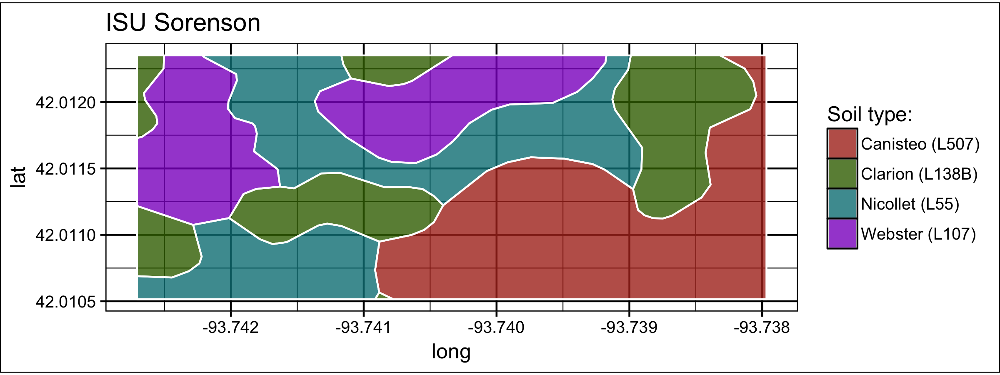

# ApsimSoil-SSURGO

This repo contains R code for downloading soils data from [SSURGO database](https://websoilsurvey.nrcs.usda.gov) and converting it into [APSIM](https://http://www.apsim.info/) format.

Code here relies heavily on the [FedData](https://cran.r-project.org/web/packages/FedData/index.html) package. APSIM parameter set estimation follows the approach described by [Archontoulis et al. (2014, Agron. J. 106(3):1025-1040)](https://dl.sciencesocieties.org/publications/aj/abstracts/106/3/1025?access=0&view=pdf).

## download_SSURGO: Download spatial data for a field extent and return soil profiles with APSIM values

Before using this function, make sure you have installed the following packages:

```{r}
install.packages(c("sp","FedData","raster","tidyverse","ggthemes"))
```

You will need to define the soil layer structure using the `soilLayer_breaks` arguement. Latitudinal extent of the area of interest is defined in the `north` and `south` arguements. Longitudinal extent of the area of interest is defined in the `east` and `west`.

```{r}
source("_code/download_ssurgo.R")

h <- downloadSSURGO(SiteName = "ISU Sorenson", 
                    # Set soil layer structure
                    soilLayer_breaks = c(5,20,50,80,120,180), 
                    # Set field extent (in Decimal Degrees)
                    north=42.012351, # Latitude
                    south=42.010515, # Latitude
                    east=-93.737968, # Longitude
                    west=-93.742707, # Longitude
                    map = TRUE) 

````
The function will return a list of objects inclding: `site_name`, field centroid `coordinates`. 
```{r}
h$site_name
# [1] "ISU Sorenson"

h$coordinates
# [1]  42.01235 -93.73797
```
If `map = TRUE`, then it also returns a map with the downloaded data.

```{r}
h$map
```


The `soils` object contains a list of each soil types, with the relative area each soil type occupies in the field, and a table for the APSIM-relevant variables interportated according to the defined layer structure. Use this table to set up APSIM.

```{r}
h$soils$Canisteo$area
# [1] 0.3081301

h$soils$Canisteo$horizon
```

|layer   | thick  |  CN2   | sand   |  clay  |   wetbd|  drybd |  om    | ksat   |  ll    | dul    |  ph    | bd |
|:------:|:------:|:------:|:------:|:------:|:------:|:------:|:------:|:------:|:------:|:------:|:------:|:------:|
|1|    40| 82.5| 21.00000| 32.00000| 1.050000| 1.150000| 7.0000000| 243.7338 |0.1940000| 0.3150000 |7.410000 |1.050000|
|2|   140| 82.5 |23.14474| 32.51398 |1.156497 |1.309474 |5.9288651 |245.0878 |0.2055296 |0.3218125 |7.636296 |1.156497|
|3|   290| 82.5| 32.13656| 26.99472| 1.343194| 1.492859| 2.3362377| 645.8077| 0.1645688| 0.2966529| 8.203786 |1.343194|
|4|   290| 82.5| 45.40164| 17.47388| 1.543776| 1.621767| 0.5311222 |792.5670| 0.1078192| 0.2558955| 8.833126 |1.543776|
|5|   390| 82.5| 49.00000| 15.00000| 1.600000| 1.660000| 0.2500000 |792.5670| 0.0950000 |0.2460000| 9.000000 |1.600000|
|6|   590| 82.5| 49.00000| 15.00000| 1.600000| 1.660000| 0.2500000 |792.5670| 0.0950000 |0.2460000| 9.000000 |1.600000|

## Convert downloaded data into APSIM .soils file type


